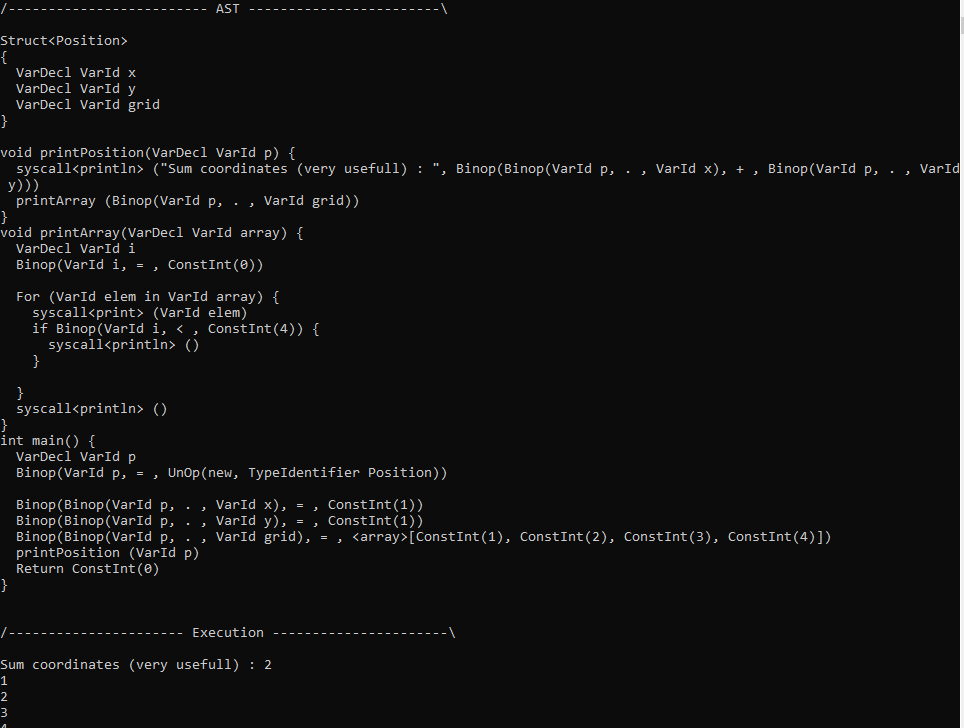
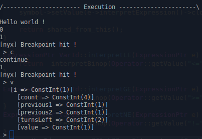

# Nyx

Projet personnel pour le fun, la passion...
Ebauche d'un interpréteur avec une syntaxe proche de celle du C.

Exemple simple :

```C++
struct Position
{
    int x;      // User coordinates
    int y;
    int[] grid; // Grid content (0 if empty, 1 for walls, 2 for player)
}

void printPosition(Position p)
{
    $println("Sum coordinates (very usefull) : ", p.x + p.y);
    printArray(p.grid);
}

/*
  Prints an array of integers !
*/
void printArray(int[] array)
{
    let i = 0;
    for (elem in array)
    {
        $print(elem);
        if (i < 4) { $println(); }
    }
    $println();
}

int main()
{
    let p = new Position;
    p.x = 1;
    p.y = 1;
    p.grid = [1, 2, 3, 4];

    printPosition(p);

    return 0;
}
```

Capture d'écran du résultat :


Exemple d'utilisation du debugger avec l'utilisation de *$debugBreak()* :


# Détails

- Le dossier parser contient la lexer ainsi que l'analyseur syntaxique, ce dernier étant basé sur le pattern visitor.
- Le dossier ast contient les classes permettant de créer l'arbre de syntaxe abstrait
- Le dossier symbol contient le nécessaire pour gérer la table des symboles (classe singleton).
- Le dossier global permet d'avoir des info sur le fichier sur lequel on travail (va nous permettre d'afficher la ligne comportant une erreur par exemple..)
- Le dossier compilo contient la classe faisant appel aux précédent dossiers et classes qu'ils contiennent, afin d'interpretter le fichier source donné

# TODO

- Analyse statique / variables non utilisées : corriger position du symbol
- Ajouter import
- Refaire index de tableau
- Ajouter classes
